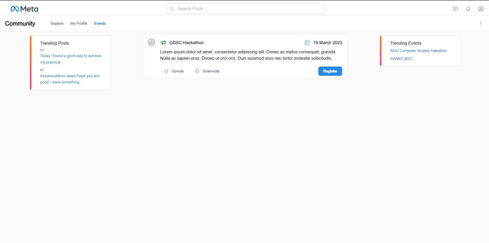

# Social Media Website Node js

Current Featurs:
-> user can login/signup
-> user can post his thoughts
-> can explorer new peoples
-> can see and register for events
-> User can view his profile

Roadmap:
-> Plans for jobs & startups
-> chat rooms
-> Groups & Forums
-> And Few More

